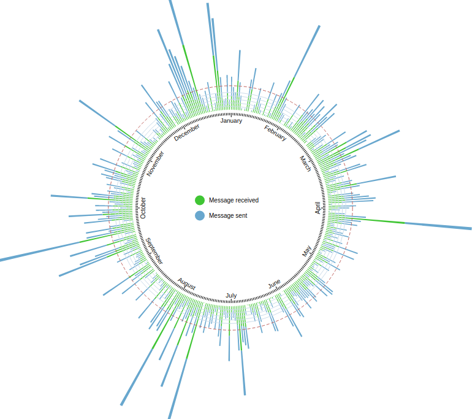
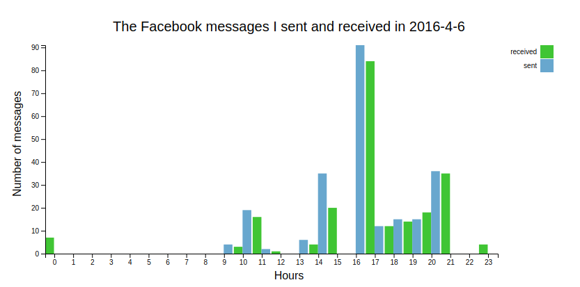
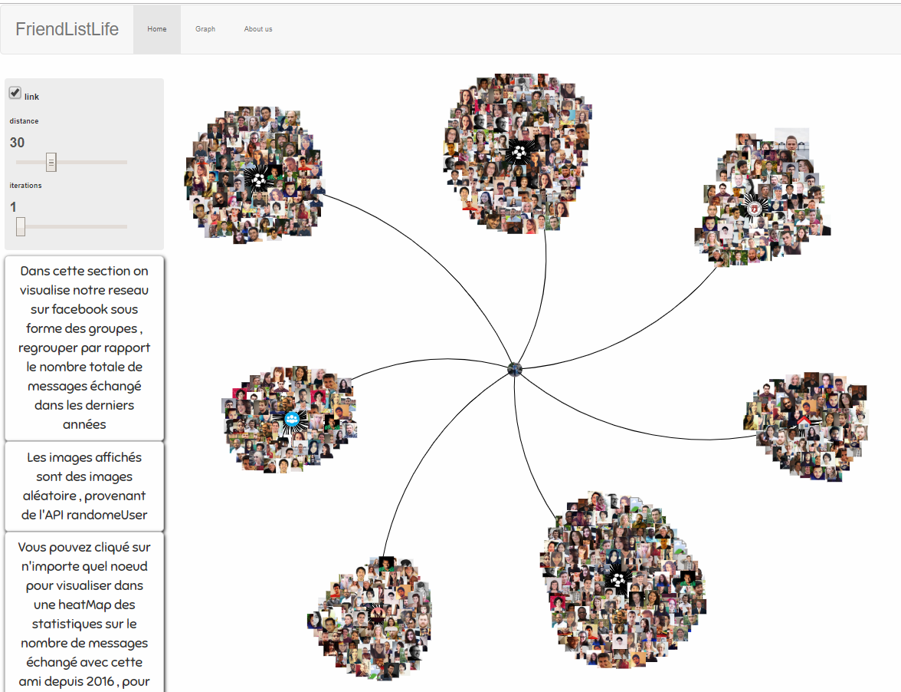
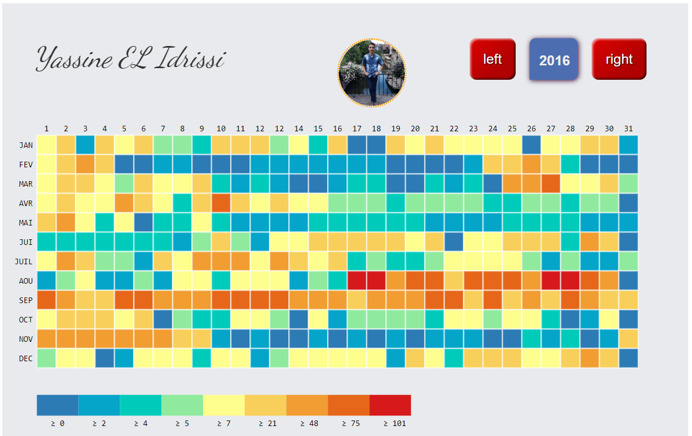

# FriendsListLife
## Facebook Messages Visualization by year,day and hour
[Site](https://mehdiadim.github.io/FriendsListLife/) par Mehdi Adim & khalid aissi

### By year and day

 The goal of this project is to allow you to visualize your own variation of Facebook Messages in your browser, with a nice graphical display that gives insights on the number of messages you send and receive by year, day, and hours.

### By day and hour

## How does it work ?

First, you should extract your data from Facebook in JSON format [Site](https://www.facebook.com/your_information/). Once you've got your data ready, you can go on the [webSite](https://mehdiadim.github.io/FriendsListLife/).

Use your own file and explore your own data.

# graph by category

In this section we visualize our network on facebook by groups, grouping in relation to the total number of messages exchanged in recent years.
The images displayed are random images, from the randomeUser API.
You can click on any node to view in a heatMap statistics on the number of messages exchanged with this friend since 2016, to return to the graph click anywhere on the heatMap.

# heatmap per person

The colors reflect the number of messages exchanged per day. 9 colors are used which with a scale that changes from one person to another according to the maximum number of messages exchanged in a day.
