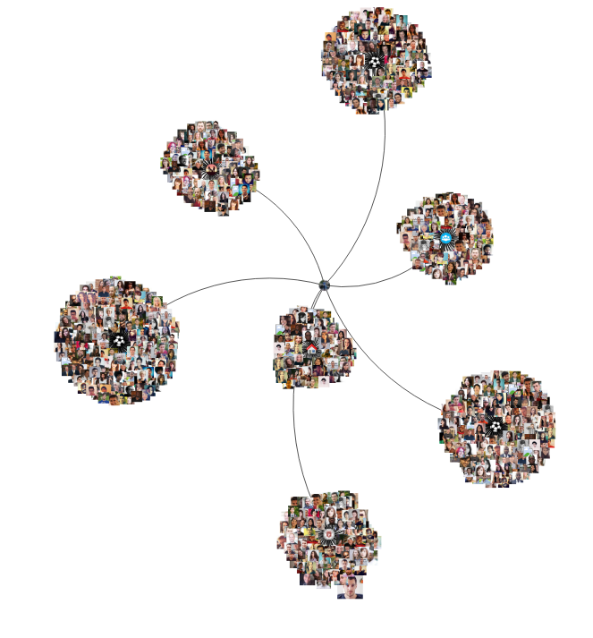
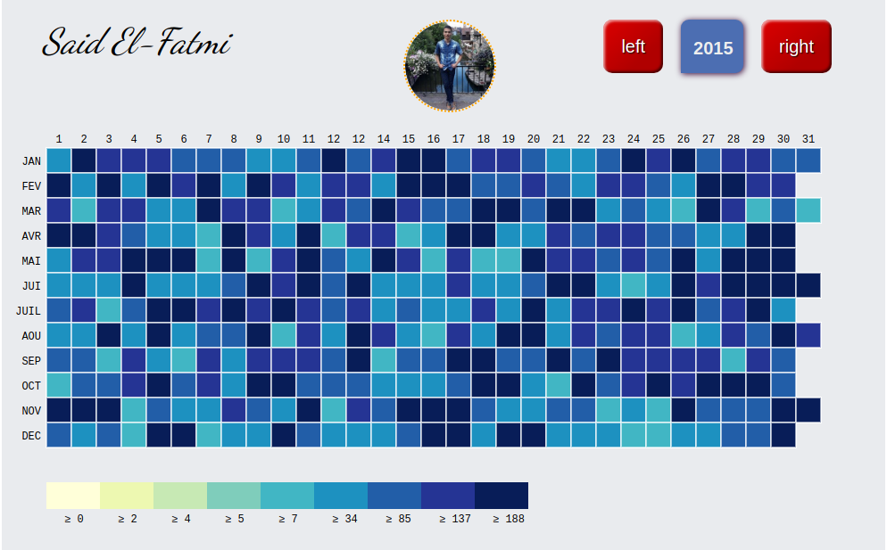

# FriendsListLife
## Facebook Messages Visualization by year,day and hour
[Site](https://mehdiadim.github.io/FriendsListLife/) par Mehdi Adim & khalid aissi

### By year and day

 The goal of this project is to allow you to visualize your own variation of Facebook Messages in your browser, with a nice graphical display that gives insights on the number of messages you send and receive by year, day, and hours.

### By day and hour

## How does it work ?

First, you should extract your data from Facebook in JSON format [Site](https://www.facebook.com/your_information/). Once you've got your data ready, you can go on the [webSite](https://mehdiadim.github.io/FriendsListLife/).

Use your own file and explore your own data.

# graph by category

# heatmap per person

